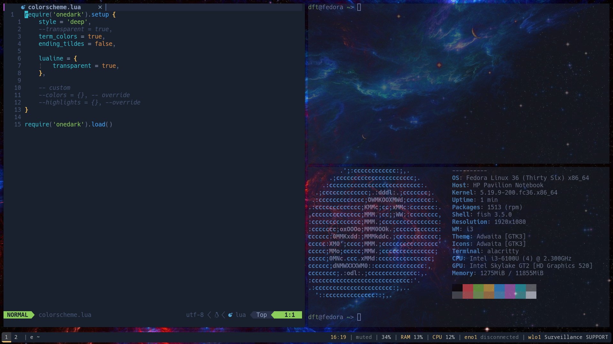

i3-gaps on fedoraOS, alacritty terminal with fish shell



---

## Installation steps

```
alias config='/usr/bin/git --git-dir=$HOME/.cfg/ --work-tree=$HOME'
```
```
echo ".cfg" >> .gitignore
```
```
git clone --bare git@github.com:dfthan/dotfiles.git $HOME/.cfg
```
```
alias config='/usr/bin/git --git-dir=$HOME/.cfg/ --work-tree=$HOME'
```
```
config checkout
```

Hide unadded files for clarity
```
config config --local status.showUntrackedFiles no
```

To store possible old config files out of the way
```
mkdir -p .config-backup && \
config checkout 2>&1 | egrep "\s+\." | awk {'print $1'} | \
xargs -I{} mv {} .config-backup/{}
```
--- 
Credits to durdn
https://www.atlassian.com/git/tutorials/dotfiles
